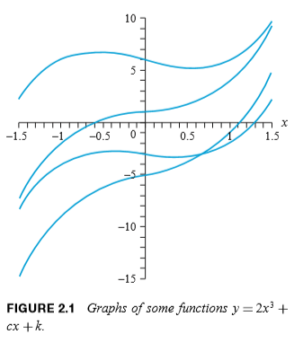

2단원에서는 이계 선형미분방정식을 이해하고 이것의 일반해를 찾는 방법들을 배운다. 크게 Homogeneous 방정식과 Nonhomogeneouse 방정식에 대해 각각 1가지, 3가지 방법이 있으며, 이 외에도 오일러 미분방정식을 다룬다. 또한 멱급수 표현에 대해서 배울 것이다.

## 이계 선형미분방정식

 이계 선형미분방정식이란, 이계도함수를 포함하며 차수가 2인 선형 미분방정식을 말한다. 기본적으론 다음과 같은 꼴을 가진다.
$$
y''+p(x)y'+q(x)y=f(x)
$$
 적분을 두번 하여 해를 구해야 하기 때문에, 이 방정식의 해에는 미지수가 2개 생긴다. 다른 말로, 미지수로 가능한 모든 원소에 대해 방정식은 만족한다. 일계 선형미분방정식과는 달리 그래프상 평행이동이 아니라 여러 모양을 가지기도 한다.

### 초기값 문제, 특수해의 유일성

 일계 선형미분방정식과 마찬가지로, 여기서 초기값 문제란 이계 선형미분방정식의 특수해를 결정하는 문제를 말한다. 즉 일반해에서 발생하는 2개의 미지수를 찾는 문제이다. 미지수가 2개이기 때문에 주어지는 값 역시 2개여야 한다. 일반적으로 $y(x_0)$과 $y'(x_0)$이 주어진다. 이 값들이 주어지면 특수해가 유일하게 결정된다.

## Homogeneous 방정식

 Homogeneous 방정식은 우변의 $f(x)$가 0인 특수한 경우이다. 즉 다음과 같은 꼴의 방정식을 말한다.
$$
y''+p(x)y'+q(x)y=0
$$
 Homogeneous 방정식의 풀이를 위해선 선형 조합을 이용해야 한다. 이러한 Homoeneous 방정식 풀이는 Non-Homogeneous 방정식의 풀이에서도 중요한 전략으로 이용하게 된다.

### 선형성

 어떤 함수가 다음 성질을 만족할 때, 이 함수는 선형적이라고 말한다.
$$
\forall u,v \in D, \text{함수 }T\text{에 대해}\\T(u+v)=T(u)+T(v)\\T(cu)=cT(u)
$$

#### 선형 조합

 이계 선형미분방정식의 특수해 $y_1$과 $y_2$, 그리고 어떤 상수 $c_1$과 $c_2$에 대해 $c_1 y_1 + c_2 y_2$를 $y_1$과 $y_2$의 선형 조합이라고 말한다. 이것은 Homogeneous 방정식에서 중요한데, $y_1$과 $y_2$ 모두 Homogeneous 방정식의 해라면 $c_1 y_1 + c_2 y_2$ 역시 방정식의 해가 되는 성질 때문이다.

#### 선형 종속성과 Wronskian Test

 $cos(x)$와 $sin(x)$는 $y''+y=0$ 의 특수해이지만 둘은 선형 독립적이다. 즉 둘은 임의의 상수 $c$를 곱해도 다른 함수가 될 수 없다. 미분방정식은 Homogeneous하기 때문에, $c_1 cos(x) + c_2 sin(x)$ 역시 방정식의 해가 될 것이며 이는 새로운 해를 도출한다. 선형 독립적이라는 말은 어떤 두 함수가 임의의 상수를 곱해도 다른 한 쪽이 될 수 없음을 의미한다. 선형 종속적은 이와는 반대이다.

 Wronskian Test는 두 특수해가 선형 독립적인지를 판단하는 방법이다. 여기에 쓰이는 함수 Wronskian은 다음과 같이 정의된다.
$$
W(y_1, y_2)=\det\begin{vmatrix}y_1 & y_2 \\ y_1' & y_2' \end{vmatrix} = y_1 y_2' - y_2 y_1'
$$
 때로는 $W(x)$로 쓰기도 한다. 

 Wronskian의 성질로 첫째, $\forall x \in I$인 $x$에 대해서 $W(x)=0$이거나 $W(x)\ne0$이다. 둘째, 구간 $I$에서 $W(x) \ne 0$이면 구간 $I$에서 $y_1$과 $y_2$는 선형 독립적이며, 역도 성립한다. 두번째 성질은 선형 독립성을 판단하기 위해 이용되며, 이 경우를 특히 Wronskian Test라고 부른다.

### 이계 Homogeneous 방정식 풀이의 큰 흐름

 위 성질들을 종합하여, 이계 Homogeneous 선형 미분방정식의 기본적인 단계가 세워지게 된다. 특히 "구간 $I$ 위에서, 서로 선형 독립적인 $y_1$과 $y_2$가 방정식 $y''+py'+qy=0$의 특수해라면, 이 방정식의 모든 해는 $y_1$과 $y_2$의 선형 조합으로 이루어진다"를 이용하게 된다. 정리하면 아래와 같다.

1. 선형 독립적인 특수해 $y_1$과 $y_2$를 찾는다.
2. 둘의 선형조합 $y = c_1 y_1 + c_2 y_2$는 방정식의 해이며, 모든 특수해를 이렇게 나타낼 수 있다.

 이러한 이유로, 1에서 찾는 $y_1$과 $y_2$를 구간 $I$의 fundamental set of solutions 라고 하며, 이 둘의 선형 조합 $c_1 y_1 + c_2 y_2$를 구간 $I$에서 방정식의 일반해라고 부른다.

 방정식의 일반해를 찾고 나면, 초기값 문제는 주어진 값을 이용해 $c_1$과 $c_2$를 구함으로서 쉽게 해결할 수 있다. $c_1$과 $c_2$는 일반적으로 다음과 같이 구할 수 있다.
$$
y(x_0)=A,y'(x_0)=B \text{ 일때,}\\c_1=\frac{Ay_2'(x_0)-By_2(x_0)}{W(x_0)}\\c_2=\frac{By_1(x_0)-Ay_1'(x_0)}{W(x_0)}
$$

## Non-Homogeneous 방정식

 Non-Homogeneous 방정식은 이름 그대로 Homogeneous가 아닌 방정식을 말한다. 여기서는 일반적인 이계 선형미분방정식의 꼴을 말한다. 즉, 아래와 같이 우변이 0이 아닌 $x$에 대한 함수라면 Non-Homogeneous 방정식이다.
$$
y''+p(x)y'+q(x)y=f(x)
$$
  Homogeneous의 경우와는 달리,  선형 독립적인 특수해의 합 또는 상수배는 해가 될 수 없다. 

 그러나 차는 해가 될 수 있으며, 이 해는 또한 $f(x)=0$일 때의 associated Homogeneous 방정식도 마찬가지이다. 이 덕분에 다음과 같은 성질을 만족한다.
$$
\text{Non-Homogeneous 방정식의 어느 두 특수해 }Y_1, Y_2\text{와}\\ \text{방정식에 대응되는 associated Homogeneous 방정식의 해 }y_1, y_2\text{에 대해}\\
Y_1-Y_2=c_1 y_1 + c_2 y_2 \\
Y_1 = c_1 y_1 + c_2 y_2 + Y_2
$$
 이는 Non-Homogeneous 방정식의 해는 또 다른 해와 associated Homogeneous의 해의 선형조합의 합으로 나타낼 수 있다는 것을 시사한다. 즉 Non-Homgeneous 방정식의 일반해는 다음과 같은 꼴을 가진다.
$$
y(x) = c_1 y_1(x) + c_2 y_2(x) + y_p(x)
$$
### 이계 미분방정식 풀이의 큰 흐름

 그리고 이 일반해를 찾기 위해선 다음과 같은 과정을 거치게 된다.

1. associated Homogeneous 방정식의 일반해($c_1 y_1(x) + c_2 y_2(x)$)를 찾아라.
2. Non-Homogeneous 방정식의 특수해 하나 ($y_p(x)$)를 찾아라.
3. 앞에서 구한 둘을 더한 것이 Non-Homogeneous의 일반해가 된다.

 이를 종합하면, 모든 이계 선형미분방정식 풀이의 큰 윤곽이 그려진다. 이계 선형미분방정식은 Homogeneous와 그렇지 않은 것으로 구분하되, Non-Homogeneous 방정식 역시 Homogeneous 방정식의 풀이를 이용하여 해결할 수 있게 된다.

## 상수 계수 Homogeneous 방정식의 풀이

 이제부터 직접적인 풀이법을 알아볼 것이다. 우선 Homogeneous 방정식 중에서도 계수 $p(x)$와 $q(x)$가 어떤 상수로 결정된 방정식에 대해 다뤄보자. 이 방정식은 다음과 같은 모습일 것이다.
$$
y'' + ay' + by = 0
$$

 ### 해법

 $e^{rx}$는 미분하더라도 자기자신 $e^{rx}$의 상수($r$)배가 된다. $y=e^{rx}$라면, 방정식은 모든 항에 $e^{rx}$가 곱해진 r에 대한 이차방정식이 되고, $e^{rx}>0$이므로 이를 나눠 제하면 일반적으로 $r$을 구할 수 있다. 근의 공식에 따라 $r=\frac{-a \pm \sqrt{a^2-4b}}{2}$이다. 또한 판정식 $\sqrt{a^2-4b}$와 0과의 대소 비교에 따라 실근, 중근, 허근 3가지 경우로 나뉘게 된다.

#### 실근의 경우

 $r$이 두 실근 $r_1, r_2$를 가질 경우, 미분방정식의 일반해는 아래와 같다.
$$
y=c_1 e^{r_1x}+c_2 e^{r_2x}
$$

#### 중근의 경우

 $r$이 중근을 가질 경우, 본래 방법대로라면 특수해가 될 $y_1$과 $y_2$중 하나만을 구할 수 밖에 없다. 다행히 $e^{rx}$만이 아니라, $xe^{rx}$ 역시 미분방정식의 해가 될 수 있다. 첫째를 $y_1$에, 둘째를 $y_2$에 대입한다면 일반해는 $y=(c_1+c_2x)e^{rx}$가 된다. 이때, 중근을 가지면 $r=-\frac{a}{2}$이므로 아래와 같이 생각할 수도 있다.
$$
y=(c_1+c_2x)e^{-\frac{ax}{2}}
$$

#### 허근의 경우

 $\sqrt{a^2-4b}<0$ 이라면 $r$은 두 허근 $r_1 = \alpha + i\beta$, $r_2 = \alpha - i\beta$로 나타나게 된다. 이 경우, 실근의 경우와 마찬가지로 일반해는 $y=c_1 e^{(\alpha + i\beta)x}+c_2 e^{(\alpha - i\beta)x}$로 나타나지만, 오일러 항등식에 따라 $e^{\pm i\beta x}$를 좀 더 정리할 수 있다. 오일러 항등식은 다음과 같다.
$$
e^{ikx} = \cos(kx) + i\sin(kx)
$$
 이를 정리하여 일반해를 다시 쓰면 아래와 같다.
$$
y = c_1 e^{\alpha x}\cos(\beta x) + c_2 e^{\alpha x} \sin(\beta x)
$$

### 오차와 stable

 어떤 방정식이든 작은 오차가 해를 구하면 큰 차이로 나타날 때, 이를 unstable하다고 부른다. 위와 같이 이계 미분방정식에서 일반해를 구하는 것이 대표적이다. 더 엄밀히 말하면 아래와 같다.
$$
y'' + py' + qy = 0\text{ 의 일반해 }y_1와 \\
y'' + (p+\epsilon)y' + (q+\epsilon)y = 0\text{ 의 일반해 }y_2\text{에 대해} \\
\text{일반적으로, }\lim_{\epsilon \to 0}y_2 \ne y_1 \text{이다}
$$
 이와 달리 특수해를 구하는 문제, 즉 초기조건 문제는 stable하다. 즉 아래와 같다.
$$
\text{다항방정식 }y_1(x)\text{에서 식의 계수 }a\text{ 대신 }a+\epsilon\text{로 치환한 새로운 식을 }y_2(x)\text{라고 하자.}\\
\text{일반적으로, }\lim_{\epsilon \to 0}y_2(x)=y_1(x)이다.
$$

## Non-Homogeneous 방정식의 특수해 구하기

 이제 $y_p(x)$를 구하기 위해선 Non-Homogeneous 방정식, 그러니까 $y''+p(x)y'+q(x)y=f(x)$의 특수해를 구해야 한다. 여러 방법으로 할 수 있다.

### 미정계수법

 Undetermined Coefficients라고도 불린다. $y_p(x)$를 $f(x)$에 기초하여 조금 변형한 식으로 가정하고 확인한다. 이 변형에는 크게 세 가지 법칙이 있다. [#](https://min-97.tistory.com/24) 

 첫째로, $f(x)$의 항들에 따라 $y_p(x)$를 다음과 같이 바꾼다.

| $f(x)$의 항                                                | $y_p(x)$에서                            |
| ---------------------------------------------------------- | --------------------------------------- |
| $ke^{\gamma x}$                                            | $Ce^{\gamma x}$                         |
| $kx ^n \text{(단 n은 0 또는 자연수)}$                      | $K_nx^n+K_{n-1}x^{n-1}+\cdots+K_1x+K_0$ |
| $k\cos(wx)$ 또는 $k\sin(wx)$                               | $K\cos(wx)+M\sin(wx)$                   |
| $ke^{ax}\cos(wx)$ 또는 $ke^{ax}\sin(wx)$                   | $e^{ax}(K\cos(wx)+M\sin(wx))$           |
| $P(x)e^{\gamma x}\cos(wx)$ 또는 $P(x)e^{\gamma x}\sin(wx)$ | $e^{ax}(Q(x)K\cos(wx)+R(x)M\sin(wx))$   |

 두번째로,  첫번째에서 바꾼 식이 Homogeneous 풀이에서 구한 해와 같을 수 있다면 $x$ (중근과 겹칠 경우 $x^2$)를 곱한 채로 바꾼다.

 마지막으로 $f(x)$가 표의 함수들의 합으로 구성되어 있다면, $y_p(x)$ 역시 그에 대응되는 함수들의 합으로 추정한다.

 그러나 이 방법이 언제나 유효하지는 않다. 대개 우변이 다항식이거나, $e^{x^2}$처럼 $e$의 지수가 최대 2차식이거나, $\cos \sin$ 함수로 이루어질 때 사용할 수 있다. 

 또한 새로운 $y_p(x)$가 associated homogeneous 방정식의 해인 경우, (우변이 0이 아닐 때) Non-homogeneous 방정식이 성립하지 않게 된다. 다행이 이 경우에는 $y_p(x)$ 대신 $x\cdot y_p(x)$ (associated homogeneous 방정식이 중근을 가지면 $x^2\cdot y_p(x)$)를 생각하면 해결할 수 있다.

#### 중첩(superposition)의 원리

$$
y_1,y_2,\cdots y_k \text{가 n계 Homogeneous 선형 미분방정식의 해라면, }
\text{상수 }c_1,c_2, \cdots c_k\text{에 대해서}\\
y=c_1 y_1 + c_2 y_2 + \cdots +c_k y_k \text{ 역시 방정식의 해이다.}
$$

 이 원리에 따라,  $f(x)=f_1(x)+f_2(x)+ \cdots + f_n(x)$ 일 때, $y''+p(x)y'+q(x)y=f_i(x)$의 해 $Y_i(x)$에 대해서 $y_p(x)=Y_1(x)+Y_2(x)+\cdots+Y_n(x)$이다. 이 성질 덕분에 $f(x)$의 항을 보고 바꿔도 $y_p(x)$를 해로 생각할 수 있어서, 미정계수법이 한결 간편해질 수 있다.

### 매개변수변환법

 Variation of Parameters라고도 불린다. 

 Homogeneous 방정식이 중근을 가질 때, $y_1=e^{-ax/2}$라면 $y_2=xe^{-ax/2}$와 같이 $x$를 새로 곱하였다. 이는 비단 $x$만이 아니라, 이계도미분이 0인 $x$에 대한 함수이기만 하면 된다. 매개변수변환법은 이 방법의 연장선으로, associated Homogeneous 방정식의 특수해 $y_1$과 $y_2$에 대해 $y_p=u_1(x)y_1(x) + u_2(x)y_2(x)$로 생각하고 접근하는 것이다. 이때 $u_1$과 $u_2$에 대해서 $u_1'y_1+u_2'y_2=0$ 이라는 조건을 두고 진행한다. 

 위 조건을 두고 $y_p$를 식에 대입해서 전개하면, $u_1'y_1'+u_2'y_2'=f(x)$을 얻게 된다. 위 조건  $u_1'y_1+u_2'y_2=0$과 더불어, $u_1'$과 $u_2'$를 제외하곤 모두 주어져 있기 때문에 이 둘은 두 식을 연립하여 구할 수 있다. 이를 통해 구한 $u_1$과 $u_2$는 아래와 같다.
$$
u_1'=-\frac{y_2(x)f(x)}{W(x)}, \ u_2'=\frac{y_1(x)f(x)}{W(x)}\\
u_1'=-\int\frac{y_2(x)f(x)}{W(x)}dx, \ u_2'=\int\frac{y_1(x)f(x)}{W(x)}dx
$$
 이때 $W(x)$는 Wronskian, 즉 $y_2y_1'-y_1y_2'$이다.

 적분을 하기 때문에 미정계수법보단 복잡할 수 있으나, 미정계수법으로 할 수 없는 식도 접근할 수 있기에 좀 더 일반적인 방법이다.

## Euler 미분방정식

 각 항의 계수가 상수였던 위 방정식과는 달리, Euler 미분방정식은 각 항에서 $y$의 미분차수와 $x$의 지수가 같은 방정식이다. 아래와 같은 모습을 가진다.
$$
x^2y''+Axy'+By=0
$$

### 해법

 이는 $y=x^r$로 두면서 해결할 수 있다. $y=x^r$일때, $xy'=rx^r$이 되고 $x^2y''=r(r-1)x^r$이 되어 식이 $r$에 대한 이차방정식으로 바뀌게 된다. 즉 아래와 같이 바뀐다.
$$
y=x^r,\ x \ne0,\\
r(r-1)x^r+Arx^r+Bx^r=0,\\
r(r-1)+Ar+B=0
$$
 상수계수 Homogeneous 방정식의 해법과 마찬가지로, $r$이 실근인지 중근인지, 아니면 허근인지에 따라 나눠진다.

#### 실근의 경우

 근이 실수 $r_1$과 $r_2$로 나오면, 미분방정식의 일반해는 아래와 같다.
$$
y(x)=c_1x^{r_1}+c_2x^{r_2} \quad (x>0)
$$

####  중근의 경우

 근이 $r_1$ 하나만 나온다면, 미분방정식의 특수해 $y_1$은 $y_1(x)=x^{r_1}$일 것이다. $y_2(x)=u(x)x^{r_1}$으로 가정하고 전개하면 $u(x)=C_1\ln x+C_2$이게 된다. 이때 $C_1, C_2$는 적분상수이므로 간단하게 $u(x)=\ln x$로 두고 진행한다. 이를 통해 구한 일반해는 다음과 같다.
$$
y(x)=c_1x_1^{r_1}+c_2\ln(x)x^{r_1}
$$

#### 허근의 경우

 근이 복소수 $r_1=\alpha + i\beta, \ r_2 = \alpha - i\beta$ 로 나온다면, 특수해는 $y_1(x)=x^{\alpha + i\beta}$, $y_2(x)=x^{\alpha - i\beta}$로 나올 것이다. 이때 오일러 항등식에 따라 다음과 같이 전개할 수 있다.
$$
x^{\pm i\beta}=e^{\ln (x^{\pm i\beta})}=e^{\pm i\beta \ln x},\\
y_1=x^\alpha(\cos(\beta\ln x)+i\sin(\beta \ln x)) \\
y_2=x^\alpha(\cos(\beta\ln x)-i\sin(\beta \ln x)) \\
\text{이 둘을 연립하여 }i\text{를 소거하고 전개하면,} \\
y(x)=c_1x^\alpha \cos(\beta \ln x) + c_2x^\alpha \sin(\beta \ln x)
$$

## 멱급수 방법

 Power Series Solutions이라고 불린다.

 앞서 1단원에서, Linear equation은 적분상수 $\int p(x)dx$를 곱하여 계산한다고 하였다. 식을 계산하다보면 마지막에 $\int q(x)e^{\int p(x)dx} dx$를 계산하게 되는데, 식이 간단하다면 쉽게 할 수 있을지 몰라도 적분 자체가 불가능한 꼴로 나타나기도 한다. 멱급수는 이런 상황에서 적분식을 무한급수로 표현하여 해결할 수 있게 해 준다.

 멱급수란 중심 $x=x_0$에 대해 다음과 같이 정의된다. 특히 아래와 같이 중심 $x=0$에 대한 멱급수를 자주 사용한다.
$$
\sum^{\inf}_{n=0}a_n(x-x_0)^n \\
\sum^{\inf}_{n=0}a_nx^n \quad (x_0=0)
$$

### 해법

 $y(x)$를 위와 같이 $x=0$에 대한 멱급수로 가정하고, $y'$과 $y''$을 구하여 식에 대입한 뒤 풀이를 진행한다. $y'$과 $y''$은 다음과 같이 전개된다.
$$
y(x)=\sum^{\inf}_{n=0}a_nx^n \\
y'(x)=\sum^{\inf}_{n=1}na_nx^{n-1} \\
y''(x)=\sum^{\inf}_{n=2}n(n-1)a_nx^{n-2}
$$
 보다시피 $n$이 시작하는 위치가 달라지게 되는데, 이를 $n=0$으로 통일시키고 (이 과정에서 $a_0, a_1, \cdots$ 등이 시그마 안에 표현되지 않아 따로 적어줘야 하기도 한다) 각 시그마를 하나로 합치면 된다. 또한 모든 $a_n$을 한정된 상수로 표현할 수 있어야 한다.

## Frobenius Solution

$$
P(x)y'' + Q(x)y' + R(x)y = F(x) \\
\frac{d^2 y}{dx^2} + \frac{Q(x)}{P(x)}\frac{dy}{dx} + \frac{R(x)}{P(x)}y = \frac{F(x)}{P(x)} \quad(P(x)\ne 0)
$$

 이계미분방정식을 이계미분의 계수로 나눠 멱급수로 전개할 수 있도록 하는 방법이다. 

 다만 여기서 분모로 오는 $P(x)$는 0이 아니어야 하므로, $P(x)$가 0인 경우를 따로 생각한다. 이때 $P(x_0)=0$인 singular point $x_0$이 regular한지를 따지는데,  아래 값들이 존재할 때, 즉 멱급수 확장이 가능하다면 $x_0$을 regular하다고 말한다.
$$
(x-x_0)\frac{Q(x)}{P(x)} \\
(x-x_0)^2\frac{R(x)}{P(x)} \\
$$

 여기서 $x_0$이 regular해야 Frobenius Solution으로 접근할 수 있다.

 Frobenius Solution은 멱급수와 비슷하지만 $x^r$이 곱해진 $y(x)=\sum^\inf_{n=0} c_nx^{n+r}$로 가정하고 (이때 $c_0 \ne 0$) $r$을 구하는 것을 목표로 한다.

### 해법 

 Homogeneous와 마찬가지로 $F(x)=0$인 방정식의 특수해들을 구하고 일반해를 구한다.

 멱급수와 비슷하게, $y(x)=\sum^\inf_{n=0} c_nx^{n+r}$로 가정하고 $y'$과 $y''$을 식에 따라 대입하여 $r$에 대한 급수 방정식을 푼다. (Homogeneous이고 $x^r$은 급수 전체에 곱해져 있으므로 구할 수 있다고 한다) 또한 마찬가지로 $c_n$들 역시 몇 개의 $c$로 모두 (재귀적으로) 표현할 수 있어야 한다. 

 방정식 풀이를 통해 $r$을 구했다면, $r$은 이차방정식의 해로 두 근을 가지게 된다. $r_1 \ge r_2$ 라 할 때, 다음 세가지로 경우를 나누어 풀이를 진행한다. 이때 모든 $c$는 0이 아니다.

- $r_1 - r_2$가 정수가 아님 : $y_1(x)=\sum^\inf_{n=0} c_nx^{n+r_1}$, $y_2(x)=\sum^\inf_{n=0} c^*_nx^{n+r_2}$ 이다.
- $r_1 - r_2 = 0$ : $y_1(x)=\sum^\inf_{n=0} c_nx^{n+r_1}$, $y_2(x)=y_1(x)\ln(x)\sum^\inf_{n=0} c^*_nx^{n+r_2}$이다. $y_2$의 $c^*_n$은 Homogeneous 방정식에 $y_2$를 다시 대입하여 구한다.
- $r_1 - r_2$가 정수임 : $y_1(x)=\sum^\inf_{n=0} c_nx^{n+r_1}$, $y_2(x)=ky_1(x)\ln(x)\sum^\inf_{n=0} c^*_nx^{n+r_2}$이다.