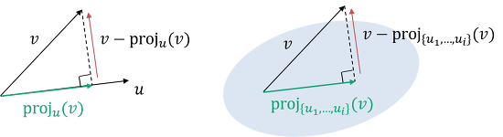

## $\mathbb{R}^{3}$ 벡터공간

 벡터공간이란, 실수 순서쌍을 가지는 실수공간 $\mathbb{R}^n$ 위에 정의되는 벡터들의 집합을 말한다. 벡터와 관련된 용어로 다음이 있다.

- 스칼라 : 하나의 값을 가지는 물리량.
- 벡터 : 크기와 방향을 가지는 물리량. 실수공간 위의 점으로 나타날 수 있다.

 여기서는 3차원의 경우만을 살피고, 이후에 n차원의 경우로 일반화하여 볼 것이다.

 어느 벡터가 원점 $(0,0,0)$에서 시작하여 $(x, y, z)$를 끝으로 가진다면, 그 벡터를 $(x, y, z)$로 나타낸다. 또한 이 순서쌍이 같다면 같은 벡터로 취급한다. 즉 $(a,b,c)$에서 시작하여 $(a+x, b+y, c+z)$에서 끝나는 벡터 역시 $(x,y,z)$로 같다.

 또한 벡터는 행렬에서 행 또는 열이 하나인 특수한 경우로도 생각할 수 있다. 이런 이유로 벡터 표기를 행렬과 같이 $\mathbf{V}$처럼 볼드체로 나타내기도 한다.

### 벡터 연산

#### 벡터의 크기

 벡터의 크기(또는 길이)는 스칼라로, 원점으로부터 벡터 끝의 점까지 유클리드 거리이다. 즉 아래와 같다.
$$
|\mathbf{V}|:\mathbb{V} \mapsto \mathbb{R}\\
\mathbf{V}=(x,y,z)\text{라면}\\
\text{벡터의 크기는 }\left| \mathbf{V} \right| = \sqrt{ x^2+y^2+z^2 }
$$

#### 상수배

 벡터의 상수배는 벡터의 크기만을 상수배가 된 벡터이다.
$$
\alpha\mathbf{V}:\mathbb{(R,V)} \mapsto \mathbb{V}\\
\mathbf{V}=(x,y,z)\text{라면}\\
\alpha \mathbf{V}=(\alpha x,\alpha y, \alpha z)
$$

#### 벡터의 덧셈

 벡터와 벡터의 합은 각 좌표를 서로 더한 새로운 벡터와 같다.
$$
\mathbf{V}_1+\mathbf{V}_2:\mathbb{(V,V)} \mapsto \mathbb{V}\\
\mathbf{V}_1 = (x_1, y_1, z_1), \mathbf{V}_2=(x_2, y_2, z_2) 라면\\
\mathbf{V}_1+\mathbf{V}_2 = (x_1+x_2,\ y_1+y_2,\ z_1+z_2)
$$

 또한 벡터의 크기와 더불어, 벡터의 성질로 $\lVert V_1 + V_2 \rVert \le \lVert V_1 \rVert + \lVert V_2 \rVert$가 성립한다. 이는 삼각부등식과 같다.

### 단위벡터

 단위벡터는 어떤 방향을 가지며 크기가 1인 벡터로 정의된다. 서로 선형 독립적인 단위벡터들은 공간을 구성하는 기저이기도 하다. 즉, 공간 위의 모든 벡터를 단위벡터들의 상수배와 합으로 나타낼 수 있다. 3차원의 실수공간에서 단위벡터는 아래와 같이 나타낸다.
$$
\mathbf{i}=(1,0,0)\\
\mathbf{j}=(0,1,0)\\
\mathbf{k}=(0,0,1)\\
$$
 고로 3차원 공간 위의 모든 벡터는 $\mathbf{i,j,k}$의 상수배와 합으로 나타낼 수 있다. 그러나 이것만이 단위벡터는 아니며, 서로 선형 독립이라면 다른 벡터 쌍도 얼마든지 가능하다.

#### 단위벡터 표현

 어떤 벡터를 크기가 1인 단위벡터로 나타내려면 그 벡터의 크기를 1로 만들면 된다. 즉 크기의 역수만큼 상수배를 하면 된다.
$$
\vec{u}=\frac{1}{|\vec{v}|}\vec{v}
$$

### 벡터 기하

 하나의 벡터는 같은 차원의 좌표공간에서 점을 나타낼 수 있다. 또한 모든 도형은 점으로 구성된다. 고로 벡터의 집합은 공간 위의 도형이라고 생각할 수 있다.

 이 덕분에 기하학의 성질들은 벡터에도 적용된다. 예를 들어, 직선을 나타내기 위해선 최소 두개의 점이 필요하며, 점 대신 벡터로 생각해도 무관하다.

#### 직선의 방정식

 임의의 점 $P$와 벡터 $\vec{V}$가 주어지면 다음과 같이 한 직선을 표현할 수 있다.
$$
l:P+\vec{V}t \ (t \in \mathbb{R})
$$
 또한 이 직선의 방향벡터를 $\vec{V}$ (또는 $\vec{V}t$ 중 하나)라고 표현한다.

### 내적 (Dot product)

 어느 두 벡터의 내적은 각 성분의 곱을 모두 합한 스칼라로 정의된다. 즉 다음과 같다.
$$
V_1 \cdot V_2 : \mathbb{(V,V)\mapsto R}\\
V_1 = (x_1, y_1, z_1), V_2=(x_2, y_2, z_2) 라면\\
V_1 \cdot V_2 = x_1 x_2 + y_1 y_2 + z_1 z_2
$$

#### 내적의 기하학적 성질

 또한 좌표공간 위에서 내적의 정의는 다음과 동일하다.
$$
V_1, V_2 \text{가 벡터라면}\\
V_1 \cdot V_2 = \lVert V_1 \rVert \lVert V_2 \rVert \cos(\theta)\\
\text{이때 }\theta\text{는 두 벡터가 이루는 각}
$$
 이 덕분에 다음과 같은 성질이 성립한다.

- $\lVert V_1 \cdot V_2\rVert \le \lVert V_1 \rVert^2 + \lVert V_2 \rVert^2$ (코시-슈바르츠 항등식의 특수한 경우)
- 두 벡터가 이루는 각이 수직(orthogonal)이라면, 두 벡터의 내적은 0이다. 역도 성립한다.

#### 사영 (Projection)

 어떤 벡터 $\vec{v}$를 다른 벡터 $\vec{u}$에 사영한 것은 아래와 같다.
$$
\text{proj}_\textbf{u}\textbf{v}=\frac{\textbf{u}\cdot\textbf{v}}{\lVert\textbf{u}\rVert^2}\textbf{u}
$$
 기하적으로 이 새로운 벡터는 $\textbf{v}$를 $\textbf{u}$에 사영한 것과 같다. 

### 외적 (Cross Product)

 어느 두 벡터의 외적은 각 성분을 교차하여 곱한 벡터로 정의된다. 자세히 말하자면 다음과 같다.
$$
V_1 \times V_2 : \mathbb{(V,V) \mapsto V} \\
V_1 = a_1 \mathbf{i} + b_1 \mathbf{j} + c_1 \mathbf{k},\ V_2 = a_2 \mathbf{i} + b_2 \mathbf{j} + c_2 \mathbf{k} \text{ 라면}\\
V_1 \times V_2 = (b_1 c_2 - b_2 c_1) \mathbf{i} + (a_2 c_1 - a_1 c_2 ) \mathbf{j} + (a_1 b_2 - a_2 b_1) \mathbf{k}\\
= \begin{vmatrix}
\mathbf{i} & \mathbf{j} & \mathbf{k} \\
a_1 & b_1 & c_1 \\ a_2 & b_2 & c_2
\end{vmatrix}
= \begin{vmatrix} b_1&c_1\\b_2&c_2 \end{vmatrix} \mathbf{i} - \begin{vmatrix} a_1&c_1\\a_2&c_2 \end{vmatrix} \mathbf{j} + \begin{vmatrix} a_1&b_1\\a_2&b_2 \end{vmatrix} \mathbf{k}
$$
 즉 단위벡터들의 합벡터와 각 벡터들을 행으로 나열한 정사각행렬의 행렬식이다. 마지막 서술이 그나마 외우기 편하다고 한다. 

 이 외적 연산은 다른 연산자와는 다른 규칙을 따른다.

- $V_1 \times V_2 = - V_2 \times V_1$ : 교환법칙이 성립하지 않으며, 순서를 반대로 할 시 정반대의 벡터를 갖는다.
- $\lVert V_1 \times V_2 \rVert = \lVert V_1 \rVert \lVert V_2 \rVert \sin(\theta) \ \ (\theta\text{는 두 벡터가 이루는 각)}$ 
- $V_1, V_2 \ne \mathbf{\vec{O}},\ \ V_1 \times V_2 = \vec{\mathbf{O}} \iff V_1, V_2\text{가 서로 평행하다}$ : 이를 이용해서 세 점이 한 직선에 있는지의 판별을 할 수 있다.
- 상수배와 독립적이다. 즉 상수배한 벡터를 외적한 것과 외적한 벡터를 상수배한 것은 같다.
- 벡터의 덧셈/뺄셈에 대해 분배법칙이 성립한다.

#### 내적과의 관계

 두 벡터의 내적과 외적은 다음과 같은 관계를 갖는다.
$$
\lVert V_1 \times V_2 \rVert^2 = \lVert V_1 \rVert^2 \lVert V_2 \rVert^2 - (V_1 \cdot V_2)^2
$$
 이는 $V_1 \cdot V_2 = \lVert V_1 \rVert \lVert V_2 \rVert \cos(\theta)$와 $\lVert V_1 \times V_2 \rVert = \lVert V_1 \rVert \lVert V_2 \rVert \sin(\theta)$를 이용하여 증명할 수 있다.

#### 외적의 기하학적 성질

 좌표공간 위에서 외적 $V_1 \times V_2$는 $V_1$과 $V_2$에 대해 동시에 수직한다. 이는 $V_1 \cdot (V_1 \times V_2)$와 같이 내적을 이용하여 확인할 수 있다.

 이 성질을 통해 외적을 써서 두 벡터 (또는 최소 세 점)을 지나는 평면의 법선벡터를 구할 수 있다.

## $\mathbb{R}^{n}$ 벡터공간

 3차원 공간에서 벡터는 3개의 성분으로 표현되듯이, n차원 공간에서 벡터는 n개의 성분으로 표시된다. 기본적인 사항은 아래와 같다.
$$
\text{n차원 공간에서의 벡터는 n개의 실수 순서쌍으로 정의된다. 즉, }\mathbb{R}^n \text{위의 벡터 } V_1 \text{는 아래와 같다.} \\
V_1 = (x_1, x_2, x_3, \cdots , x_n) \\
$$

- 동치관계

$$
\text{동치 관계 } V_1 (x_i) = V_2(y_i) : \mathbb{(V,V)}\text{는 다음과 같이 정의된다.} \\
V_1 = V_2 \iff x_1 = y_1, x_2 = y_2, \cdots x_n = y_n
$$

- 상수배

$$
\alpha V_1:\mathbb{(R,V)} \mapsto \mathbb{V}\\
\alpha V_1 = (\alpha x_1, \alpha x_2, \cdots, \alpha x_n)
$$

- 덧셈, 뺄셈

$$
V_1+V_2:\mathbb{(V,V)} \mapsto \mathbb{V}\\
V_1+V_2 = (x_1 + y_1, x_2 + y_2, \cdots, x_n + y_n)
$$

### Norm

 2차원, 3차원에서의 길이(크기)를 일반화한 개념이다. 마찬가지로 유클리드 거리로 정의된다.
$$
V \text{가 벡터라면, } V\text{의 Norm은 아래와 같다.} \\
\lVert V \rVert = \sqrt{x_1^2 + x_2^2 + \cdots + x_n^2}
$$

### 내적

 3차원까지의 모든 내적의 성질을 그대로 적용할 수 있다. 교환법칙, 결합법칙이 성립하며, 또한 코시-슈바르츠 부등식도 성립한다. 

 ### 단위벡터

 n차원에서의 단위 벡터들은 모두 서로 수직이다. 이렇게 단위 벡터이며 서로 수직인 벡터들을 orthonormal set이라고 부른다. 각 벡터는 $\mathbf{e}^n$과 같이 표기한다.

## 일반화

 n차원 벡터공간에 대해 쉽게 접근하기 위해 여러 개념들이 생긴다.

### subspace

 subspace는 다음을 만족하는 벡터 집합 $S\text{ (on } \mathbb{R}^n)$를 말한다.
$$
1. \ \mathbf{O} \in S \\
2. \ \forall \vec{v} \in S, \sum \vec{v} \in S \\
3. \ \forall c \in \mathbb{R}, c\vec{v} \in S
$$
 즉 영벡터를 포함하며, 선형조합을 통한 귀납법으로 표현할 수 있는 모든 벡터를 포함하는 집합이다. 이 subspace는 벡터의 상수배, 덧셈에 대해 닫혀있다.

 subspace도 종류가 나뉘는데 아래와 같다. 모두 영벡터를 포함하기 위해 원점을 지나게 된다.

- 원점을 지나는 직선
- 원점을 지나는 평면

 이들은 그보다 높은 차원의 공간 안에서도 각각 1차원 공간, 2차원 공간을 가진다.

### 선형조합, span

 $k$개의 벡터들의 선형조합은 각 벡터들의 상수배의 합을 말한다. 즉 아래와 같다.
$$
\alpha_1 \vec{v}_1 + \alpha_2 \vec{v}_2 + \cdots \alpha_k \vec{v}_k \quad
(\alpha_j \in \mathbb{R})
$$
 이때 이 선형조합으로 나타낼 수 있는 벡터들의 집합을 space spanned by 라고 하며, 여기서 $\vec{v}_i$의 순서쌍은 그 공간을 span한다고 한다.

 특정 벡터들을 이용한 선형조합은 그 벡터들이 span하는 공간 상의 모든 지점을 표현할 수 있다. $\mathbb{R}^2$를 예로 하면, $(0, 1), (1, 0)$이 span 벡터가 되며 이 둘의 선형조합은 평면 위의 모든 좌표를 나타낼 수 있다. (또는 $\mathbb{R}^2$를 span한다) 또한 집합 $\{(0, 1), (1, 0) \}$은 $\mathbb{R}^2$의 spanning set이라고도 불린다.

 spanning set은 유일하지 않다.  n차원 subspace에 대한 spannig set이 되기 위해서는 최소 n개의 선형 독립적인 벡터가 있어야 한다. 즉, 해당 벡터들은 한 벡터를 다른 벡터의 상수배로 표현할 수 없어야 한다. 또한 n개의 벡터가 충분하다면 선형 종속적인 벡터가 있어도 상관없다. $\mathbb{R}^2$인 경우, $\{(0, 1), (1, 0)\}$ 외에도 $\{(1, 3), (2, 2)\}, \{(3, 3), (1, 0), (2,2)\}$ 등도 spanning set이 될 수 있다.

### basis

 또한, spannin set이 최소한의 벡터를 가진다면 (즉 서로 선형 독립적이면) 그 span 벡터를 basis(기저)라고도 부른다. 즉, orthogonal set인 spanning set은 곧 basis이다. 나아가 basis 벡터의 수는 basis가 span하는 subspace의 dimension(차원)이 된다.

 선형조합을 판단하는 다른 방법으로, 모든 벡터들의 선형조합으로 영벡터를 만들 수 없다면 (상수 $\alpha_j$가 모두 0이 되어야만 영벡터라면) 선형 독립이라고 판단할 수 있다.

 참고 [#](https://twlab.tistory.com/24)

#### mutually orthogonal set

orthogonal set 중에서도 모든 벡터들이 서로 직교하는 것을 mutually orthogonal하다고 한다. 다른 말로 정규직교기저라고도 한다.

#### Gram-Schmit 직교화

 주어진 벡터들에 대한 직교기저 (정규직교기저)를 구하는 과정을 말한다. 벡터공간 위 어떤 basis의 벡터들 $\mathbf{v}_i$에 대해, 그 subspace의 직교기저 $\mathbf{u}_i$는 일반적으로 다음과 같이 구할 수 있다.
$$
\mathbf{u}_1 = \mathbf{v}_1\\
\mathbf{u}_i = \mathbf{v}_i - \sum^{i-1}_{t=1}\text{proj}_{\mathbf{u}_t}\mathbf{v}_i\\
= \mathbf{v}_i - (\alpha_1\mathbf{u}_1 + \alpha_2\mathbf{u}_2 + \cdots + \alpha_{i-1}\mathbf{u}_{i-1})
$$
 즉 $\mathbf{v}_i$에 $\mathbf{v}_i$를 벡터공간 $\{\mathbf{u}_1, \mathbf{u}_2, \cdots, \mathbf{u}_{i-1}\}$사영한 것을 뺀 것과 같다. 이는 그림과 같이 벡터공간 $\{\mathbf{u}_1, \mathbf{u}_2, \cdots, \mathbf{u}_{i-1}\}$과 수직이다. [#](https://darkpgmr.tistory.com/165)

 또한 각 $\mathbf{u}_i$를 그 크기로 나눈 (정규화한) $\mathbf{e}_i$는 subspace의 정규직교기저가 된다.

 주의할 점으로 $\mathbf{v}_i$는 basis, 즉 서로 선형 독립적이어야 한다.

### orthogonal complements

 $\mathbb{R}^n$ 위의 어떤 subspace $S$에 대해, $S$의 모든 벡터와 직교하는 벡터의 집합을 $S$의 orthogonal complements라고 부르며 $S^\perp$로 표기한다.

 orthogonal complements의 성질로 다음이 있다.

- $S$와 $S^\perp$에 동시에 속하는 벡터는 영벡터뿐이다.
- $\mathbb{R}^n$의 벡터 $\mathbf{u}$에 대해, $\exist (\mathbf{u}_S \in S, \mathbf{u}^\perp \in S^\perp), \mathbf{u} = \mathbf{u}_S + \mathbf{u}^\perp$ 이며 각 $\mathbf{u}_S, \mathbf{u}^\perp$는 유일하다.

### projection

> $S$의 벡터 $\mathbf{u}$에 대해, $\exist (\mathbf{u}_S \in S, \mathbf{u}^\perp \in S^\perp), \mathbf{u} = \mathbf{u}_S + \mathbf{u}^\perp$ 이며 각 $\mathbf{u}_S, \mathbf{u}^\perp$는 유일하다.

 여기서 $\mathbf{u}_S$를 $\mathbf{u}$의 $S$에 대한 정사영(orthogonal projection)이라 부른다.

 정사영을 구하는 방법은 Gram-Schmit 직교화와 비슷하게, S의 각 기저 벡터에 대한 사영의 합으로 나타내어 구할 수 있다.
$$
\mathbf{u}_S=\sum\text{proj}_\mathbf{u}\mathbf{v}_i \\
\text{이때 }\mathbf{v}_i\text{는 }S\text{의 기저 벡터}
$$
 이렇게 $\mathbf{u}_S$를 구함으로써  $\mathbf{u}^\perp = \mathbf{u}-\mathbf{u}_S$ 역시 구할 수 있다.

 또한 다음이 성립한다.
$$
\forall \mathbf{v}\in S,\lVert \mathbf{u}-\mathbf{u}_S \rVert < \lVert \mathbf{u}-\mathbf{v}\rVert
$$
 기하적으로 이는 $\mathbf{u}^\perp$의 Norm은 $\mathbf{u}$에서부터 $S$까지의 최소 거리라는 의미이다. 이렇게 $\mathbf{u}^\perp$의 크기를 구하는 방법을 least squares 방법이라고 하며, 그 크기를 곧 least squares라고도 부른다.

 least squares는 오차로도 불리는데, 선형회귀로 구한 $S$와의 거리를 곧 오차로 생각할 수 있기 때문이다.